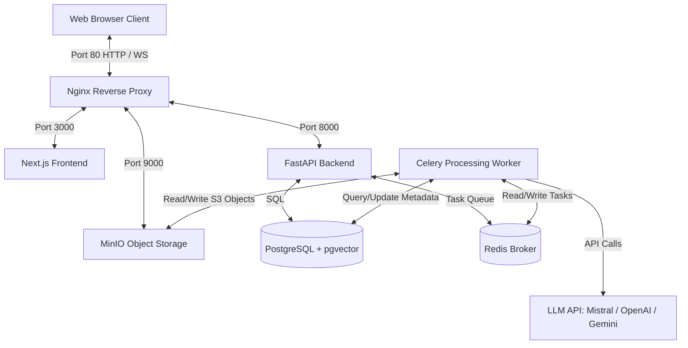

# VidNotes 🎥 📝
An AI-powered video lecture parsing, indexing, and study notes generation workspace. Transform long lectures, tutorials, and presentation videos into structured academic guides, inline slides keyframes, interactive mind maps, flashcard study decks, and chatbot workspaces.


---

## 🏗️ System Architecture

VidNotes is designed with a containerized, decoupled microservice architecture optimized for processing heavy video, audio, OCR, and AI workloads:



### Component Breakdown
1. **Nginx Reverse Proxy**: Orchestrates routing for the frontend, backend APIs, and handles MinIO storage bucket requests (`/vidnotes-storage/`) via a single port 80.
2. **Next.js Frontend**: Responsive dark-mode dashboard workspace featuring interactive HTML5/YouTube players, Markdown editors, study deck carousels, and a live AI chatbot.
3. **FastAPI Backend**: Exposes clean, typed REST endpoints for workspace operations, RAG chat vectors query, and PDF/Word note generation.
4. **Celery Worker**: Asynchronous processing pipeline. Handles audio extraction, Whisper speech-to-text, keyframe extraction, EasyOCR processing, and LLM orchestration.
5. **PostgreSQL + pgvector**: Stores application data, relational metadata, transcription segments, and 1536-dimensional semantic embeddings for contextual RAG searches.
6. **Redis**: In-memory broker for scheduling tasks and syncing celery pipeline jobs.
7. **MinIO**: Local S3-compatible object storage serving keyframe slide captures, audio extracts, and uploads.

---

## ✨ Features & Capabilities

* **🧠 Automated Ingestion**: Input a YouTube URL or upload a local video file (`.mp4`, `.mov`, etc.).
* **📝 Dynamic Captions Processing**: 
  - Automatically fetches English and language-priority subtitles (`en` -> `hi`).
  - Fallback logic to audio extraction and local Faster-Whisper transcription.
  - **Grouped Timestamps**: Grouped dynamically into 20-second paragraph segments to avoid messy, cluttered timestamp lists.
* **🖼️ Slide Extraction & OCR**: Extracts video keyframes at smart intervals and runs OCR (EasyOCR) to read slide texts.
* **📚 Two-Phase Notes Generation**:
  - Leverages LLM to create comprehensive summaries, glossary listings, checklists, revision guides, flashcard decks, and mind maps.
  - Splitting prompt requests to prevent JSON truncation issues.
* **💾 Rich Note Downloads**: Export study notes to **PDF** and **DOCX** with formatted headings, checklists, and inline keyframe images embedded dynamically.
* **💬 Workspace AI Chatbot**: Chat with your lecture vector index. Uses cosine similarity to cite specific parts of the video transcript.

---

## 📁 Repository Structure

```
├── backend/                  # FastAPI Application
│   ├── app/
│   │   ├── api/v1/           # API endpoints (videos, chat, folders)
│   │   ├── core/             # Configuration and Database sessions
│   │   ├── models/           # SQLAlchemy DB Models
│   │   ├── schemas/          # Pydantic Schemas
│   │   ├── services/         # LLM, Video, S3, Whisper, and Export engines
│   │   └── tasks/            # Celery worker process tasks
│   ├── Dockerfile
│   └── requirements.txt
├── frontend/                 # Next.js Application
│   ├── src/
│   │   ├── app/              # Dashboard and workspace workspace routes
│   │   ├── components/       # UI elements, Markdown renderer, Chat blocks
│   │   └── lib/              # Client API helper
│   ├── Dockerfile
│   └── package.json
├── nginx/                    # Proxy Server configurations
│   ├── nginx.conf
│   └── Dockerfile
└── docker-compose.yml        # Development Stack Orchestration
```

---

## 🚀 Quick Start & Deployment

### 📋 Prerequisites
* Docker & Docker Compose installed
* API Keys (at least one of: `MISTRAL_API_KEY`, `OPENAI_API_KEY`, `GEMINI_API_KEY`)

### 🛠️ Configuration
1. In the root directory, create a `.env` file from the configuration keys. Add your keys:
   ```env
   # API Keys
   MISTRAL_API_KEY=your_mistral_api_key
   OPENAI_API_KEY=
   GEMINI_API_KEY=

   # Database settings
   POSTGRES_USER=postgres
   POSTGRES_PASSWORD=postgres
   POSTGRES_DB=vidnotes
   ```

2. Note: For Mistral, standard models (`mistral-medium` or `mistral-large-latest`) are used for text notes, and `mistral-embed` is used for semantic RAG chunk vector embeddings.

### 🔌 Running the Stack
Launch the application containers:
```bash
docker compose up --build -d
```

This will build the backend, worker, frontend, and reverse proxy images, and stand up Postgres, Redis, and MinIO.

Once running:
* Open the Application: [http://localhost](http://localhost) (Port 80)
* API Swagger Docs: [http://localhost:8000/docs](http://localhost:8000/docs)
* MinIO Console: [http://localhost:9001](http://localhost:9001)

### 🛑 Tear Down
To stop the services and clear cache:
```bash
docker compose down
```

---

## 🛠️ Ingestion & Processing Details
When you submit a video, Celery executes the following steps:
1. **Metadata & Caption Fetching**: Checks YouTube transcripts. If they fail (e.g. 429), uses `yt-dlp` to extract timed subtitles. If missing entirely, downloads audio and runs Whisper.
2. **Keyframe Extraction**: Extracts frame slides every 30 to 120 seconds depending on video length.
3. **Slide Analysis & OCR**: Feeds frames to EasyOCR and uses LLM to clean up OCR noise and extract visual explanations.
4. **Vector Embedding**: Text segments are stored as vectors using `pgvector` for instant semantic retrieval during chat.
5. **Notes Compilation**: Summarizes content by performing two distinct LLM API queries to prevent output token truncations and generate clean Markdown.
