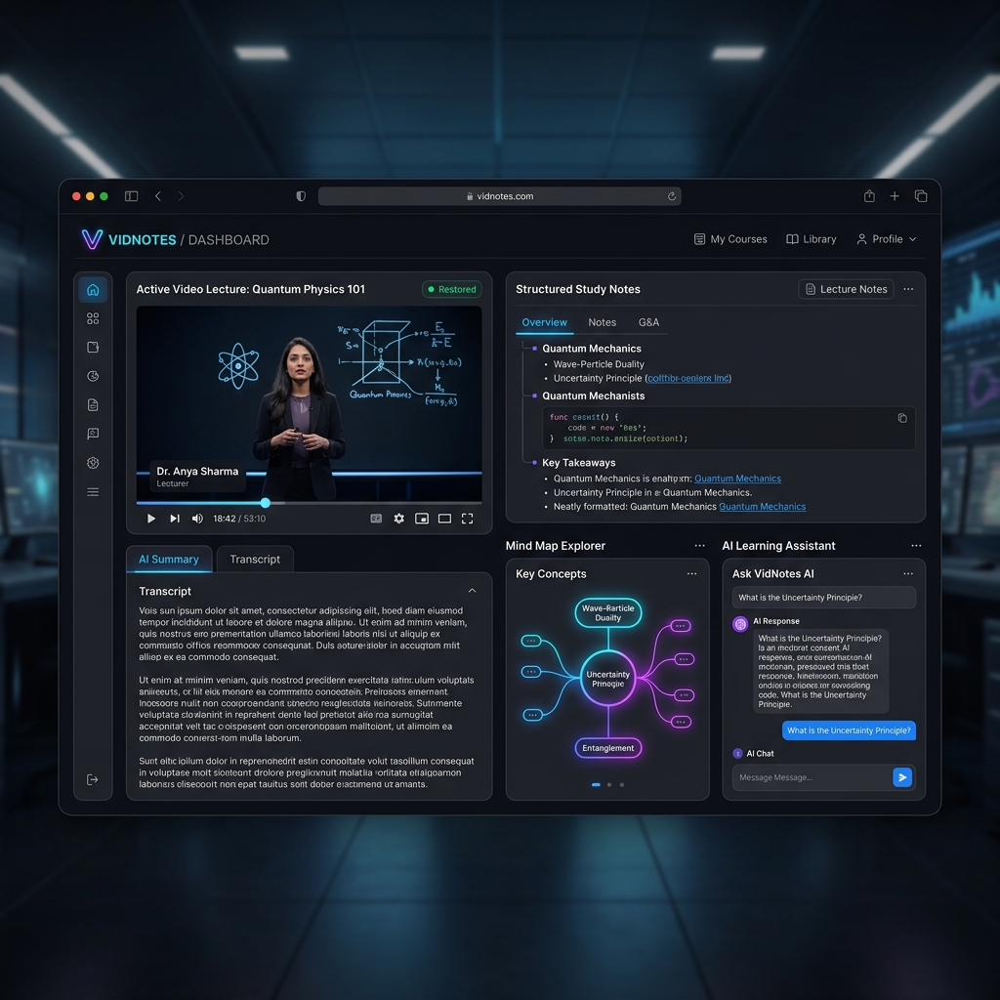
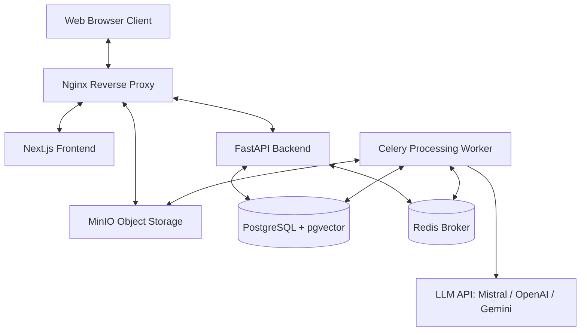

# VidNotes 🎥 📝
An AI-powered video lecture parsing, indexing, and study notes generation workspace. Transform long lectures, tutorials, and presentation videos into structured academic guides, inline slides keyframes, interactive mind maps, flashcard study decks, and chatbot workspaces.



---

## 🏗️ Detailed System Architecture

VidNotes is designed with a containerized, decoupled microservice architecture optimized for processing heavy video, audio, OCR, and AI workloads:



### 🧩 Component Breakdown & Technologies Used

1. **Nginx Reverse Proxy**: Orchestrates routing. Resolves `/api/v1/` to backend endpoints, `/vidnotes-storage/` to local MinIO storage files (enabling public access proxy), and all other traffic to the frontend.
2. **Next.js Frontend**: Constructed using **Next.js (App Router)**, **TailwindCSS**, and **Lucide Icons** for a premium dark-mode interface. Integrates **Mermaid.js** for rendering concepts maps dynamically in the UI.
3. **FastAPI Backend**: Powered by **Python FastAPI** and **SQLAlchemy (Async)**. Exposes RESTful endpoints, handles database queries, and manages document exports (`.pdf` / `.docx`) with slide images embedded via ReportLab & python-docx.
4. **Celery Worker**: Powered by **Celery** to run background jobs sequentially (preventing race conditions and server overloading).
5. **PostgreSQL + pgvector**: A database system matching SQL data with **pgvector** for vector search embeddings (1536 dimensions).
6. **Redis**: Manages the message queuing broker for Celery tasks.
7. **MinIO**: Emulates a local **S3 storage bucket** to host keyframe slide captures, audio extracts, and file uploads.
8. **EasyOCR & ffmpeg**: Used locally inside the Celery worker for slide text extraction (OCR) and audio stream extraction.

---

## 🤖 LLM Execution Pipeline & API Call Count

During a single video processing pipeline run, LLM API calls are orchestrated sequentially to ensure reliability and bypass rate-limiting. Here is exactly when and how many times the LLM is called:

### 1. Ingestion / Pre-processing Stage (Repeated per Slide Keyframe)
For each keyframe slide extracted from the video (number depends on video length, ranging from **3 to 15 keyframes**):
* **OCR Text Cleanup (1 Call per Keyframe)**: Calls the LLM to post-process raw slide OCR text, correct typos, and strip noisy characters.
* **Keyframe Vision Analysis (1 Call per Keyframe)**: Calls the vision model (`gpt-4o`, `gemini-1.5`, or `pixtral`) to generate a detailed description of diagrams, code blocks, or charts present on the slide.
* *Total calls: `2 × Keyframes count`*

### 2. Semantic Indexing Stage (Repeated per Content Chunk)
* **Text Embedding Generation (1 Call per 1000-character Chunk)**: Calls the embedding API (`text-embedding-3-small` or `mistral-embed`) to calculate a 1536-dimensional semantic representation of the grouped transcript + visual slide text for pgvector indexing.
* *Total calls: `1 × Chunks count`*

### 3. Study Notes Generation Stage (Fixed calls)
* **Summarization & Notes Packages (2 Calls)**: 
  - **Call 1**: Generates the high-level Executive Summary and Detailed Lecture Notes (with inline image placeholders matching timelines).
  - **Call 2**: Generates Student Revision Checklists, study tips, Core Key Takeaways, and Glossary items.
* *Total calls: `2`*

### 4. Interactive Study Materials Stage (On-Demand / User Triggered)
These are **never generated during initial ingestion** to avoid unnecessary API costs and rate limits. Instead, they are generated only when the user clicks their respective tabs in the workspace UI:
* **Flashcards Generation (1 Call)**: Triggered once when opening the flashcards tab for the first time.
* **Multiple Choice Quiz (1 Call)**: Triggered once when opening the quiz tab for the first time.
* **Concept Mind Map (1 Call)**: Triggered once when opening the concept map tab (produces a Mermaid syntax map).
* *Total calls: `3 (only when clicked by user)`*


---

## ✨ Features & Capabilities

* **🧠 Automated Ingestion**: Input a YouTube URL or upload a local video file (`.mp4`, `.mov`, etc.).
* **📝 Dynamic Captions Processing**: 
  - Automatically fetches English and language-priority subtitles (`en` -> `hi`).
  - Fallback logic to audio extraction and local Faster-Whisper transcription.
  - **Grouped Timestamps**: Grouped dynamically into 20-second paragraph segments to avoid messy, cluttered timestamp lists.
* **🖼️ Slide Extraction & OCR**: Extracts video keyframes at smart intervals and runs OCR (EasyOCR) to read slide texts.
* **📚 Two-Phase Notes Generation**:
  - Leverages LLM to create comprehensive summaries, glossary listings, checklists, revision guides, flashcard decks, and mind maps.
  - Splitting prompt requests to prevent JSON truncation issues.
* **💾 Rich Note Downloads**: Export study notes to **PDF** and **DOCX** with formatted headings, checklists, and inline keyframe images embedded dynamically.
* **💬 Workspace AI Chatbot**: Chat with your lecture vector index. Uses cosine similarity to cite specific parts of the video transcript.

---

## 📁 Repository Structure

```
├── backend/                  # FastAPI Application
│   ├── app/
│   │   ├── api/v1/           # API endpoints (videos, chat, folders)
│   │   ├── core/             # Configuration and Database sessions
│   │   ├── models/           # SQLAlchemy DB Models
│   │   ├── schemas/          # Pydantic Schemas
│   │   ├── services/         # LLM, Video, S3, Whisper, and Export engines
│   │   └── tasks/            # Celery worker process tasks
│   ├── Dockerfile
│   └── requirements.txt
├── frontend/                 # Next.js Application
│   ├── src/
│   │   ├── app/              # Dashboard and workspace workspace routes
│   │   ├── components/       # UI elements, Markdown renderer, Chat blocks
│   │   └── lib/              # Client API helper
│   ├── Dockerfile
│   └── package.json
├── nginx/                    # Proxy Server configurations
│   ├── nginx.conf
│   └── Dockerfile
└── docker-compose.yml        # Development Stack Orchestration
```

---

## 🚀 Quick Start & Deployment

### 📋 Prerequisites
* Docker & Docker Compose installed
* API Keys (at least one of: `MISTRAL_API_KEY`, `OPENAI_API_KEY`, `GEMINI_API_KEY`)

### 🛠️ Configuration
1. In the root directory, create a `.env` file from the configuration keys. Add your keys:
   ```env
   # API Keys
   MISTRAL_API_KEY=your_mistral_api_key
   OPENAI_API_KEY=
   GEMINI_API_KEY=

   # Database settings
   POSTGRES_USER=postgres
   POSTGRES_PASSWORD=postgres
   POSTGRES_DB=vidnotes
   ```

2. Note: For Mistral, standard models (`mistral-medium` or `mistral-large-latest`) are used for text notes, and `mistral-embed` is used for semantic RAG chunk vector embeddings.

### 🔌 Running the Stack
Launch the application containers:
```bash
docker compose up --build -d
```

This will build the backend, worker, frontend, and reverse proxy images, and stand up Postgres, Redis, and MinIO.

Once running:
* Open the Application: [http://localhost](http://localhost) (Port 80)
* API Swagger Docs: [http://localhost:8000/docs](http://localhost:8000/docs)
* MinIO Console: [http://localhost:9001](http://localhost:9001)

### 🛑 Tear Down
To stop the services and clear cache:
```bash
docker compose down
```

---

## 🛠️ Ingestion & Processing Details
When you submit a video, Celery executes the following steps:
1. **Metadata & Caption Fetching**: Checks YouTube transcripts. If they fail (e.g. 429), uses `yt-dlp` to extract timed subtitles. If missing entirely, downloads audio and runs Whisper.
2. **Keyframe Extraction**: Extracts frame slides every 30 to 120 seconds depending on video length.
3. **Slide Analysis & OCR**: Feeds frames to EasyOCR and uses LLM to clean up OCR noise and extract visual explanations.
4. **Vector Embedding**: Text segments are stored as vectors using `pgvector` for instant semantic retrieval during chat.
5. **Notes Compilation**: Summarizes content by performing two distinct LLM API queries to prevent output token truncations and generate clean Markdown.
